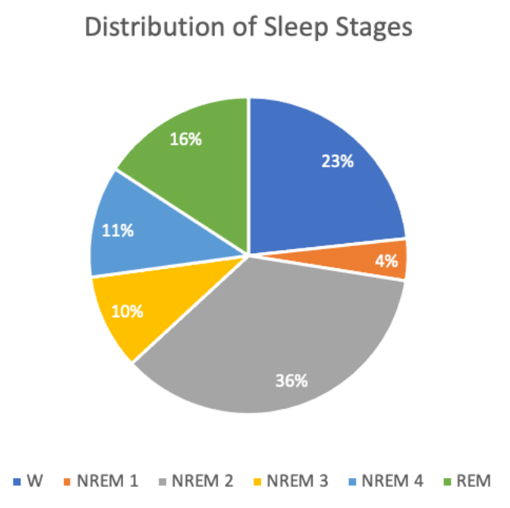

## CS4641 Summer 2022 Project - Polysomnography Data

### Infographic

### Introduction
Sleep is an important physiological process directly correlated with physical health, mental well-being, and chronic disease risk. Unfortunately, nearly 70 million Americans suffer from sleep disorders.1 The most effective measurement of sleep quality to date is collecting polysomnography (PSG) data in a sleep laboratory and measuring the duration of sleep stages. However, sleep studies are expensive, time-consuming, and inaccessible to the majority of the population. Wearables have attempted to use heart rate data and machine learning algorithms to predict sleep stage, but suffer from low accuracy.2 We intend to create a machine learning model for the automatic classification of sleep stages using a minimum viable subset of biosignals from PSG data.

### Methodology
#### Dataset
Our data source is the CAP Sleep Database on PhysioNet.3 It contains PSG recordings for 108 individuals; each waveform has over 10 channels including EEGs (brain), EMGs (chin), ECGs (heart), EOGs (eyes), and respiration signals.4 From each voltage waveform we extracted numerical measurements taken every two milliseconds. Additionally, for each individual, a text file provides labeled sleep stages every epoch (30 second interval) along with age, gender, and sleep disease information. After data preparation and feature extraction for all individuals, there were ~100,000 data points (~900 epochs for each individual) and ~10 features with at least one extracted feature from each biosignal. The target values are discrete sleep stages (Wake, REM, NREM 1-4).

#### Data Preparation
To begin, data was cleaned by combining the metadata in each individual's text file with their raw sensor measurements. Categorical data (e.g., sleep disorder) was converted to numerical form by one-hot encoding.

Next, due to physiological variability between PSG subjects and many of the recordings being taken years apart, there is high variability between the subject's baseline values. For example, one subject has an average heart rate of 60 bpm, while another's staysa around 70 bpm. More notably, the baseline ECG level for some subjects is significantly higher than others, due to factors like physiological differences and electrode connection. These differences in baselines are unique to each subject but persist through the entire recording. This was remedied by centering each individuals’s data by subtracting the mean of each of their features before combining their data with the rest of the subjects’ data.

Outliers were detected in the dataset using the Local Outlier Factor. This is a method that considers if a point is an outlier among its nearest neighbors, as opposed to considering the point in relation to the dataset as a whole. This means that extreme outliers due to recording errors are removed, but expected outliers, such as spikes in muscle activity are not removed. For example, when heart beats are overrun by noise due to recording abnormalities, certain heart rate metrics, such as the low frequency change in heart rate can spike. While this metric should be on the order of 100, some spikes were observed to be on the order of 1048. Such outliers were detected and removed based on the LOF method. Other statistical outliers, such as those due to spikes in EMG (muscle) activity are not removed using this method, which is advantageous because this type of outlier is a valid measurement that can be used to detect motion during sleep, often associated with REM and Wake sleep stages.

Finally, we applied robust scaling to our dataset using the interquartile range. We opted for robust scaling over standard scaling due to concerns regarding the effect of outliers on our dataset. The Box Cox Transformation was used to transform all features to resemble a normal distribution.

#### Feature Engineering
Feature extraction methods for each type of signal from the PSG data are described:
* __EEG__: EEG (electroencephalogram) is a technique used to detect electric activity in the brain. Manual sleep stage classification is largely dependent on the fraction of brain waves with specific frequencies (e.g., delta waves with a frequency of 1 - 4 Hz) and secondary time-domain features. In our dataset, available EEG signals differ slightly between individuals, but broadly follow the International 10-20 System. Extensive literature exists on useful EEG features, so a subset of suggested features were selected. First, the time-domain EEG signal was decomposed into the frequency-domain using Welch’s method, and the power of each frequency band of each brain wave was computed. Second, multiple entropy-based metrics (i.e., metrics conveying the amount of information given by a signal) were computed. Finally, miscellaneous more sophisticated time-domain metrics (e.g., Petrosian fractal dimension) were calculated. In total, thirteen unique features were computed using the provided EEG signals. All EEG features were averaged across each individual’s EEG channels.

* __SAO2__: SAO2 refers to a blood-oxygen saturation reading which indicates the percentage of hemoglobin molecules which are saturated with oxygen. Readings can  vary from 0 to 100%. Normal reading will range from 94% to 100%.  Reading below 50% are considered artifacts by related literature. In our dataset, some data points were labeled as SPO2. These two are synonymous for our purposes. SPO2 simply refers to the specific type of oximetry reading used. Related literature to sleep staging using oximetry data engineered features from readings by taking the peaks of each time period and the percentage of time spent above a certain threshold. We followed suit with our data by taking the maximum of each epoch and the percentage of time spent above 70%, 80%, and 90% oxygen saturation by epoch. In addition, we included the average oxygen saturation of each epoch.

* __EOG__: EOG (electrooculography) is used to detect activity within the human eye. One study aimed at Human-Computer Interaction applications mentioned a few useful features that were extracted from EOG signals, including: Maximum Peak Amplitude, which measures the maximum positive amplitude, Maximum Valley Amplitude, which measures the maximum negative amplitude, Area Under Curve, which is a summation of the absolute values of amplitude under positive and negative curves, and signal Variance. All of these metrics were calculated within each epoch. Another study that focused specifically on sleep staging estimated the Power Spectrum for the EOG signal and calculated the Energy Content Band by integrating this function over the frequency range 0.35-0.5 Hz, where REM activity is concentrated. Using a Welch method to estimate the power spectrum, we also calculated the Energy Content Band for each epoch.

* __ECG & PPG__: ECG (electrocardiogram) and PPG (photoplethysmogram) are two methods used to record heart beats during the sleep studies used to create this dataset. These signals were both used by first detecting heart beats using the hearty library. Once heart beats were located, heart rate could be calculated. Beyond heart rate, an informative set of metrics consist of those that quantify variation in heart rate. The root mean square of the differences in time between adjacent heart beats (RMSSD) is one measure of heart rate variability, which is useful in our application because it can be meaningfully calculated over short time periods, such as 30 second epochs. Heart rate changes in the frequency domain, specifically “low frequency” changes in (0.04-0.15Hz) and “high frequency” changes (0.15-0.5 Hz) have been observed to vary with sleep stage, so these were also applied using the implementation in the heartpy library.

* __EMG__ - EMG (electromyography) is a method for measuring muscle activity. The main metric used to quantify the EMG activity was energy, calculated as the sum of squared differences between each point and the sample mean, divided by the number of samples. Progression into deeper stages of sleep is typically correlated with a decrease in muscle tone, which corresponds to a decrease in baseline EMG energy, but REM sleep is also associated with brief spikes in muscle activity. To capture these transient spikes in EMG energy that were “averaged out” over an entire 30 second epoch, a moving average with a five second window was applied over each second, and the average of the five highest windows was recorded within each 30 second epoch.

Features such as heart rate, R-wave amplitude, and heart rate variability will be extracted from the ECG signal.5 Amplitude measurements in the time domain such as mean absolute value and the root mean square of the voltage signal can be extracted from EMG data.6 Potential features of EEG data are entropy7 and energy of different subband wavelets following a wavelet transform.8

After extracting features from each epoch, we will use principal component analysis (PCA) for dimensionality reduction to improve prediction quality. We may also attempt alternative approaches (e.g., prototype space feature extraction) that have been successfully applied to PSG data.9

Unsupervised methods, such as K-means, a variant called J-means,7 and Gaussian expectation maximization clustering10 will be applied to cluster epochs based on extracted features.

Supervised learning methods like random forest, K-nearest neighbors, and decision trees have been applied to sleep stage classification. In one study, these methods were applied to multiple subsets of biosignals; while all yielded a classification accuracy of ~90%, random forest consistently had the highest.11 Therefore, random forest will be our prioritized method.

In Satapathy’s analysis, a set of five PSG signals was found that resulted in high-accuracy predictions.11 We aim to extend this work and identify just 1-2 signals necessary for accurate sleep staging. A significant risk is that our model is inaccurate and leads to individuals making undesirable health decisions. Losing time is another risk given that we have 108 large waveform files and machine learning algorithms are time consuming. A potential cost is paying for a faster GPU to finish the project given our time constraint of two months.

### Results
Our expected model will use a limited number of features to predict sleep stages for each epoch with at least 85% accuracy. We expect known physiological relationships (e.g., reduced heart rate during deep sleep) to be reflected. For unsupervised approaches, we will evaluate success on mean square distance from each data point to its respective cluster center. For supervised approaches, our metric of success is accuracy against labeled sleep stages.

By the midterm checkpoint, we expect to have completed data processing, feature engineering, dimensionality reduction, and unsupervised learning tasks. For the final checkpoint, our supervised learning model will be complete and our proposed minimum viable subset of biosignals will be presented.

### Discussion
The best outcome would be a model that predicts sleep stage with high accuracy using a small number of biosignals. By eliminating non-critical biosignals, the number of required sensors to predict sleep stages would be greatly reduced. An accurate model could be integrated into cheap consumer devices to increase the accessibility of sleep data and bring the diagnostic power of sleep staging to a broad population. 

### References
1. Malekzadeh M, Hajibabaee P, Heidari M, Berlin B. Review of Deep Learning Methods for Automated Sleep Staging. 2022:0080-0086.
2. de Zambotti M, Goldstone A, Claudatos S, Colrain IM, Baker FC. A validation study of Fitbit Charge 2™ compared with polysomnography in adults. Chronobiology International. 2018/04/03 2018;35(4):465-476. doi:10.1080/07420528.2017.1413578
3. Goldberger AL, Amaral LAN, Glass L, Hausdorff JM, Ivanov PCh, Mark RG, Mietus JE, Moody GB, Peng C-K, Stanley HE. PhysioBank, PhysioToolkit, and PhysioNet: Components of a New Research Resource for Complex Physiologic Signals. Circulation 101(23):e215-e220 [Circulation Electronic Pages; http://circ.ahajournals.org/content/101/23/e215.full]; 2000 (June 13).
4. Terzano MG, Parrino L, Sherieri A, et al. Atlas, rules, and recording techniques for the scoring of cyclic alternating pattern (CAP) in human sleep. Sleep Med. Nov 2001;2(6):537-53. doi:10.1016/s1389-9457(01)00149-6
5. Li X, Ling SH, Su S. A Hybrid Feature Selection and Extraction Methods for Sleep Apnea Detection Using Bio-Signals. Sensors (Basel). 2020;20(15):4323. doi:10.3390/s20154323
6. Spiewak C, Islam R, Zaman A-U, Rahman MH. A Comprehensive Study on EMG Feature Extraction and Classifiers. Open Access Journal of Biomedical Engineering and Biosciences. February 07, 2018 2018;1(1)doi:http://dx.doi.org/10.32474/OAJBEB.2018.01.000104
7. Rodríguez-Sotelo JL, Osorio-Forero A, Jiménez-Rodríguez A, Cuesta-Frau D, Cirugeda-Roldán E, Peluffo D. Automatic Sleep Stages Classification Using EEG Entropy Features and Unsupervised Pattern Analysis Techniques. Entropy. 2014;16(12):6573-6589.
8. Amin HU, Mumtaz W, Subhani AR, Saad MNM, Malik AS. Classification of EEG Signals Based on Pattern Recognition Approach. Methods. Frontiers in Computational Neuroscience. 2017-November-21 2017;11doi:10.3389/fncom.2017.00103
9. Huang C, Lin C, Yang W, Ko L, Liu S, Lin C. Applying the fuzzy c-means based dimension reduction to improve the sleep classification system. 2013:1-5.
10. Rodríguez-Sotelo JL, Peluffo-Ordoñez D, Cuesta-Frau D, Castellanos-Domínguez G. Unsupervised feature relevance analysis applied to improve ECG heartbeat clustering. Computer Methods and Programs in Biomedicine. 2012/10/01/ 2012;108(1):250-261. doi:https://doi.org/10.1016/j.cmpb.2012.04.007
11. Satapathy S, Loganathan D, Kondaveeti HK, Rath R. Performance analysis of machine learning algorithms on automated sleep staging feature sets. CAAI Transactions on Intelligence Technology. 2021;6(2):155-174. doi:https://doi.org/10.1049/cit2.12042
