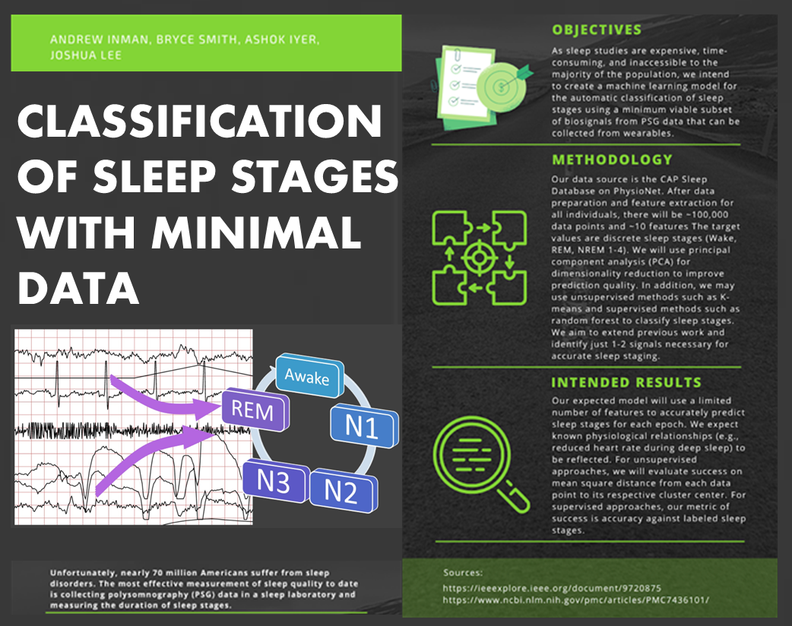

## CS4641 Summer 2022 Project - Polysomnography Data

### Infographic

### Introduction
Sleep is an important physiological process directly correlated with physical health, mental well-being, and chronic disease risk. Unfortunately, nearly 70 million Americans suffer from sleep disorders.1 The most effective measurement of sleep quality to date is collecting polysomnography (PSG) data in a sleep laboratory and measuring the duration of sleep stages. However, sleep studies are expensive, time-consuming, and inaccessible to the majority of the population. Wearables have attempted to use heart rate data and machine learning algorithms to predict sleep stage, but suffer from low accuracy.2 We intend to create a machine learning model for the automatic classification of sleep stages using a minimum viable subset of biosignals from PSG data.

### Methodology
Our data source is the CAP Sleep Database on PhysioNet.3 It contains PSG recordings for 108 individuals; each waveform has over 10 channels including EEGs (brain), EMGs (chin), ECGs (heart), EOGs (eyes), and respiration signals.4 From each voltage waveform we will extract numerical measurements taken every two milliseconds. Additionally, for each individual, a text file provides labeled sleep stages every epoch (30 second interval) along with age, gender, and sleep disease information. After data preparation and feature extraction for all individuals, there will be ~100,000 data points (~900 epochs for each individual) and ~10 features with at least one extracted feature from each biosignal. The target values are discrete sleep stages (Wake, REM, NREM 1-4).
  
Data preparation includes downsampling waveform measurements, aligning numerical data with information in the text file, converting categorical features into numerical form, and if necessary, applying log transformations to standardize numerical values.

Each type of signal from the PSG data requires a different feature extraction method. Features such as heart rate, R-wave amplitude, and heart rate variability will be extracted from the ECG signal.5 Amplitude measurements in the time domain such as mean absolute value and the root mean square of the voltage signal can be extracted from EMG data.6 Potential features of EEG data are entropy7 and energy of different subband wavelets following a wavelet transform.8

After extracting features from each epoch, we will use principal component analysis (PCA) for dimensionality reduction to improve prediction quality. We may also attempt alternative approaches (e.g., prototype space feature extraction) that have been successfully applied to PSG data.9

Unsupervised methods, such as K-means, a variant called J-means,7 and Gaussian expectation maximization clustering10 will be applied to cluster epochs based on extracted features.

Supervised learning methods like random forest, K-nearest neighbors, and decision trees have been applied to sleep stage classification. In one study, these methods were applied to multiple subsets of biosignals; while all yielded a classification accuracy of ~90%, random forest consistently had the highest.11 Therefore, random forest will be our prioritized method.

In Satapathy’s analysis, a set of five PSG signals was found that resulted in high-accuracy predictions.11 We aim to extend this work and identify just 1-2 signals necessary for accurate sleep staging. A significant risk is that our model is inaccurate and leads to individuals making undesirable health decisions. Losing time is another risk given that we have 108 large waveform files and machine learning algorithms are time consuming. A potential cost is paying for a faster GPU to finish the project given our time constraint of two months.

### Results
Our expected model will use a limited number of features to predict sleep stages for each epoch with at least 85% accuracy. We expect known physiological relationships (e.g., reduced heart rate during deep sleep) to be reflected. For unsupervised approaches, we will evaluate success on mean square distance from each data point to its respective cluster center. For supervised approaches, our metric of success is accuracy against labeled sleep stages.

By the midterm checkpoint, we expect to have completed data processing, feature engineering, dimensionality reduction, and unsupervised learning tasks. For the final checkpoint, our supervised learning model will be complete and our proposed minimum viable subset of biosignals will be presented.

### Discussion
The best outcome would be a model that predicts sleep stage with high accuracy using a small number of biosignals. By eliminating non-critical biosignals, the number of required sensors to predict sleep stages would be greatly reduced. An accurate model could be integrated into cheap consumer devices to increase the accessibility of sleep data and bring the diagnostic power of sleep staging to a broad population. 

### References
1. Malekzadeh M, Hajibabaee P, Heidari M, Berlin B. Review of Deep Learning Methods for Automated Sleep Staging. 2022:0080-0086.
2. de Zambotti M, Goldstone A, Claudatos S, Colrain IM, Baker FC. A validation study of Fitbit Charge 2™ compared with polysomnography in adults. Chronobiology International. 2018/04/03 2018;35(4):465-476. doi:10.1080/07420528.2017.1413578
3. Goldberger AL, Amaral LAN, Glass L, Hausdorff JM, Ivanov PCh, Mark RG, Mietus JE, Moody GB, Peng C-K, Stanley HE. PhysioBank, PhysioToolkit, and PhysioNet: Components of a New Research Resource for Complex Physiologic Signals. Circulation 101(23):e215-e220 [Circulation Electronic Pages; http://circ.ahajournals.org/content/101/23/e215.full]; 2000 (June 13).
4. Terzano MG, Parrino L, Sherieri A, et al. Atlas, rules, and recording techniques for the scoring of cyclic alternating pattern (CAP) in human sleep. Sleep Med. Nov 2001;2(6):537-53. doi:10.1016/s1389-9457(01)00149-6
5. Li X, Ling SH, Su S. A Hybrid Feature Selection and Extraction Methods for Sleep Apnea Detection Using Bio-Signals. Sensors (Basel). 2020;20(15):4323. doi:10.3390/s20154323
6. Spiewak C, Islam R, Zaman A-U, Rahman MH. A Comprehensive Study on EMG Feature Extraction and Classifiers. Open Access Journal of Biomedical Engineering and Biosciences. February 07, 2018 2018;1(1)doi:http://dx.doi.org/10.32474/OAJBEB.2018.01.000104
7. Rodríguez-Sotelo JL, Osorio-Forero A, Jiménez-Rodríguez A, Cuesta-Frau D, Cirugeda-Roldán E, Peluffo D. Automatic Sleep Stages Classification Using EEG Entropy Features and Unsupervised Pattern Analysis Techniques. Entropy. 2014;16(12):6573-6589.
8. Amin HU, Mumtaz W, Subhani AR, Saad MNM, Malik AS. Classification of EEG Signals Based on Pattern Recognition Approach. Methods. Frontiers in Computational Neuroscience. 2017-November-21 2017;11doi:10.3389/fncom.2017.00103
9. Huang C, Lin C, Yang W, Ko L, Liu S, Lin C. Applying the fuzzy c-means based dimension reduction to improve the sleep classification system. 2013:1-5.
10. Rodríguez-Sotelo JL, Peluffo-Ordoñez D, Cuesta-Frau D, Castellanos-Domínguez G. Unsupervised feature relevance analysis applied to improve ECG heartbeat clustering. Computer Methods and Programs in Biomedicine. 2012/10/01/ 2012;108(1):250-261. doi:https://doi.org/10.1016/j.cmpb.2012.04.007
11. Satapathy S, Loganathan D, Kondaveeti HK, Rath R. Performance analysis of machine learning algorithms on automated sleep staging feature sets. CAAI Transactions on Intelligence Technology. 2021;6(2):155-174. doi:https://doi.org/10.1049/cit2.12042
